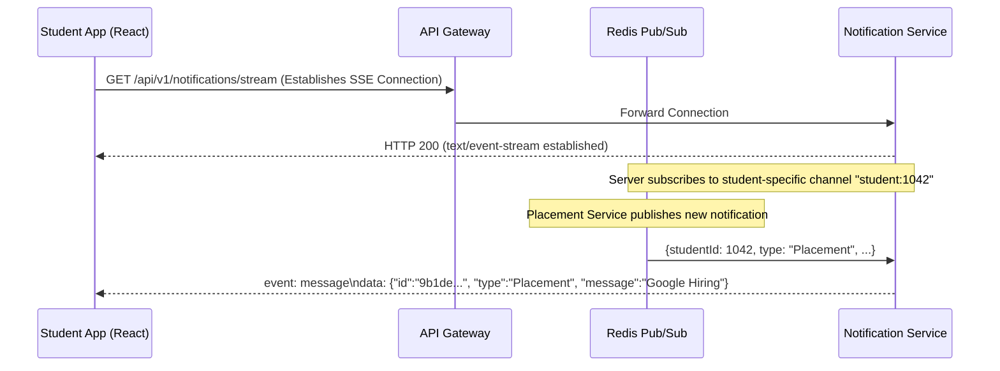
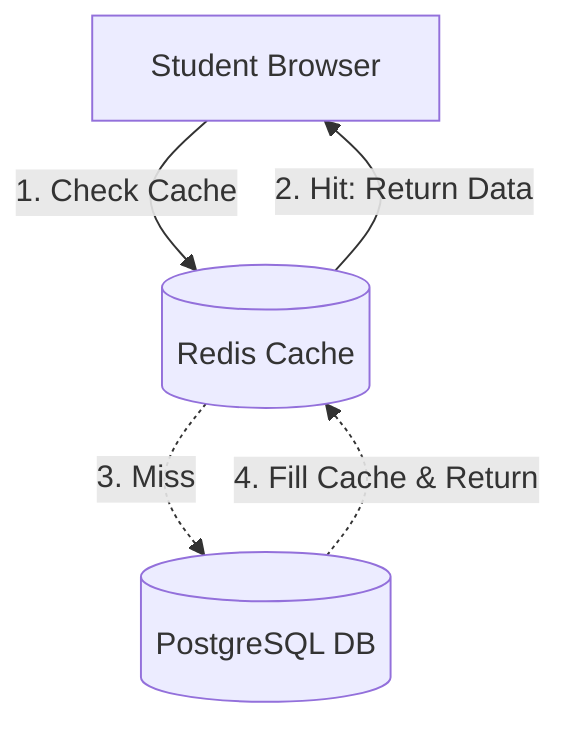
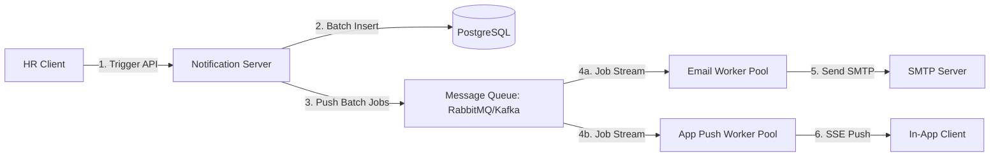

# Notification System Design Document

This document outlines the architecture, data models, scalability patterns, and algorithm designs for a student notification system.

---

## Stage 1: REST API Design & Real-Time Contract

### 1. REST API Endpoints

The notification system uses standard REST conventions for client interactions. All payloads are JSON-formatted.

#### Headers
* `Content-Type: application/json`
* `Accept: application/json`
* `Authorization: Bearer <JWT_TOKEN>` (for authentication and identifying the current student)

---

#### 1. Fetch All Notifications (Paginated)
* **Endpoint**: `GET /api/v1/notifications`
* **Query Parameters**:
  * `page` (integer, default: `1`) - Page number.
  * `limit` (integer, default: `20`) - Page size.
  * `type` (string, optional) - Filter by type (`Event`, `Result`, `Placement`).
  * `is_read` (boolean, optional) - Filter read/unread status.
* **Response Status**: `200 OK`
* **Response Payload**:
```json
{
  "success": true,
  "data": [
    {
      "id": "9b1deb4d-3b7d-4bad-9bdd-2b0d7b3dcb6d",
      "studentId": 1042,
      "type": "Placement",
      "message": "Google is hiring Software Engineers! Application deadline is June 30.",
      "isRead": false,
      "createdAt": "2026-06-17T10:00:00Z"
    }
  ],
  "pagination": {
    "currentPage": 1,
    "totalPages": 5,
    "pageSize": 20,
    "totalCount": 98
  }
}
```

---

#### 2. Get Single Notification
* **Endpoint**: `GET /api/v1/notifications/:id`
* **Response Status**: `200 OK` / `404 Not Found`
* **Response Payload**:
```json
{
  "success": true,
  "data": {
    "id": "9b1deb4d-3b7d-4bad-9bdd-2b0d7b3dcb6d",
    "studentId": 1042,
    "type": "Placement",
    "message": "Google is hiring Software Engineers! Application deadline is June 30.",
    "isRead": false,
    "createdAt": "2026-06-17T10:00:00Z"
  }
}
```

---

#### 3. Create Notification (Admin / Internal Services)
* **Endpoint**: `POST /api/v1/notifications`
* **Request Payload**:
```json
{
  "studentId": 1042,
  "type": "Placement",
  "message": "Google is hiring Software Engineers! Application deadline is June 30."
}
```
* **Response Status**: `201 Created`
* **Response Payload**:
```json
{
  "success": true,
  "message": "Notification created successfully.",
  "data": {
    "id": "9b1deb4d-3b7d-4bad-9bdd-2b0d7b3dcb6d",
    "studentId": 1042,
    "type": "Placement",
    "message": "Google is hiring Software Engineers! Application deadline is June 30.",
    "isRead": false,
    "createdAt": "2026-06-17T10:00:00Z"
  }
}
```

---

#### 4. Mark Notification as Read
* **Endpoint**: `PATCH /api/v1/notifications/:id/read`
* **Request Payload**: (None or empty object)
* **Response Status**: `200 OK`
* **Response Payload**:
```json
{
  "success": true,
  "message": "Notification marked as read.",
  "data": {
    "id": "9b1deb4d-3b7d-4bad-9bdd-2b0d7b3dcb6d",
    "isRead": true,
    "readAt": "2026-06-17T10:15:30Z"
  }
}
```

---

#### 5. Delete Notification
* **Endpoint**: `DELETE /api/v1/notifications/:id`
* **Response Status**: `200 OK`
* **Response Payload**:
```json
{
  "success": true,
  "message": "Notification deleted successfully."
}
```

---

### 2. Real-Time Notification Mechanism

To push notifications to the user without polling, we recommend **Server-Sent Events (SSE)** or **WebSockets**.

#### SSE vs WebSockets Comparison

| Criteria | Server-Sent Events (SSE) | WebSockets | Decision & Rationale |
| :--- | :--- | :--- | :--- |
| **Direction** | Unidirectional (Server -> Client) | Bidirectional (Client <-> Server) | **SSE is preferred** because notifications only flow from the server to the client. The client updates read status via REST APIs, making bidirectional communication redundant. |
| **Protocol** | HTTP / HTTPS (HTTP/2 native) | ws:// / wss:// (upgrade request) | SSE operates over standard HTTP, making it simpler to deploy, route through load balancers, and support firewalls. |
| **Reconnection**| Automatic built-in client retries | Requires manual JS implementation | SSE has built-in support for auto-reconnection and event ID tracking. |



---

## Stage 2: Persistence Storage and Queries

### 1. Database Suggestion: PostgreSQL

For this application, **PostgreSQL** is the recommended persistent store. 

#### Why PostgreSQL?
1. **ACID Compliance**: Ensuring that read statuses are saved reliably and transactionally.
2. **Indexing Capabilities**: Excellent support for B-tree and composite indexes (essential for filtering and ordering constraints).
3. **JSONB Support**: Allows storage of polymorphic metadata for notifications (e.g., custom event links, result attachments, HR details) without rigid schema changes.
4. **Partitioning**: Built-in declarative table partitioning by range (e.g., partitioning by `created_at` or `student_id`), allowing horizontal scaling as data volumes hit tens of millions.

---

### 2. DB Schema Design

```sql
-- Create Notification Categories Enum
CREATE TYPE notification_category AS ENUM ('Event', 'Result', 'Placement');

-- Notifications Table
CREATE TABLE notifications (
    id UUID PRIMARY KEY DEFAULT gen_random_uuid(),
    student_id INT NOT NULL,
    type notification_category NOT NULL,
    message TEXT NOT NULL,
    is_read BOOLEAN NOT NULL DEFAULT FALSE,
    created_at TIMESTAMP WITH TIME ZONE DEFAULT CURRENT_TIMESTAMP NOT NULL,
    read_at TIMESTAMP WITH TIME ZONE
);

-- Indexes for performance
CREATE INDEX idx_notifications_student_id ON notifications (student_id);
CREATE INDEX idx_notifications_composite_read ON notifications (student_id, is_read, created_at DESC);
```

---

### 3. Scalability Challenges & Solutions

As data volumes scale to tens of millions of records, the following challenges arise:

1. **Slow Reads**: Simple queries require scanning large B-tree indexes. As the index size exceeds RAM, database execution shifts to disk reads, slowing performance drastically.
   * **Solution**: **Table Partitioning**. Partition the `notifications` table by `created_at` (e.g., monthly partitions). Delete or archive partitions older than 90 days to cold storage, maintaining a small active index size.
2. **Write Bottlenecks**: Bulk operations (like "Notify All" to 50k students) saturate write throughput.
   * **Solution**: **Database Sharding** (distributing rows across shards based on hash of `student_id`) or scaling writes using a broker queue with rate-limited batch inserts.
3. **Connection Exhaustion**: High concurrent connections to PostgreSQL.
   * **Solution**: Use connection pooling like **PgBouncer** to multiplex connections.

---

### 4. SQL Queries matching REST APIs

```sql
-- 1. Create a notification
INSERT INTO notifications (student_id, type, message)
VALUES (1042, 'Placement', 'Google is hiring Software Engineers!');

-- 2. Fetch paginated notifications for a student
SELECT id, student_id, type, message, is_read, created_at 
FROM notifications
WHERE student_id = 1042
ORDER BY created_at DESC
LIMIT 20 OFFSET 0;

-- 3. Get single notification
SELECT * FROM notifications WHERE id = '9b1deb4d-3b7d-4bad-9bdd-2b0d7b3dcb6d';

-- 4. Mark notification as read
UPDATE notifications 
SET is_read = TRUE, read_at = NOW() 
WHERE id = '9b1deb4d-3b7d-4bad-9bdd-2b0d7b3dcb6d' 
RETURNING id, is_read, read_at;

-- 5. Delete notification
DELETE FROM notifications WHERE id = '9b1deb4d-3b7d-4bad-9bdd-2b0d7b3dcb6d';
```

---

## Stage 3: Query Performance Analysis & Optimization

### 1. Accuracy of the Query
```sql
SELECT *
FROM notifications
WHERE studentID = 1042
  AND isRead = false
ORDER BY createdAt ASC;
```
* **Accuracy Verdict**: **Inaccurate / Flawed**.
* **Reason**:
  1. The column names `studentID`, `isRead`, and `createdAt` are written in **camelCase**. Standard Relational Databases like PostgreSQL fold unquoted identifiers to lowercase (`studentid`, `isread`, `createdat`). This will lead to a `"column does not exist"` error unless the columns were created with double quotes (e.g., `"studentID"`), which is a bad design pattern. Columns should be defined in **snake_case** (`student_id`, `is_read`, `created_at`).
  2. Selecting `*` (all columns) fetches unnecessary text data (e.g., message payload), consuming higher network bandwidth and preventing the optimizer from doing index-only scans.

---

### 2. Why is this query slow?
With 5 million notifications and 50,000 students:
1. **Lack of Indexing**: Without a proper index, the database performs a **sequential scan (table scan)** over 5,000,000 rows to find records matching `student_id = 1042`.
2. **Sort Overhead**: The database must load matching records into memory and perform a sorting operation on `created_at`. If memory is constrained, it will spill to disk (WorkMem overflow), causing a massive performance penalty.
3. **Cardinality & High Density**: If a student has hundreds of unread notifications, scanning and sorting them on the fly adds to latency.

---

### 3. Changes and Computational Cost
We should rename columns to snake_case and introduce a **composite B-Tree index**:

```sql
CREATE INDEX idx_notifications_student_read_created
ON notifications (student_id, is_read, created_at ASC);
```

#### Cost Analysis:
* **Read Cost (Time Complexity)**: Dramatically reduced from $O(N)$ (where $N$ is 5M rows) to $O(\log N)$ to find the index branch, and then sequential scan of index leaves. Total query execution time drops from several seconds to $<1$ ms.
* **Write Cost**: Slight write penalty during inserts/updates because the database must update this index.
* **Storage Cost**: The index consumes extra disk space (approx. 30-40 bytes per row, resulting in ~150-200MB of index storage for 5M rows).

---

### 4. Indexing Every Column: Safe and Effective?
> [!WARNING]
> **No, this is highly ineffective and unsafe.**
* **Why it's ineffective**: Relational query planners can typically use only one index per table for a standard filter. Creating individual indexes on `student_id`, `is_read`, and `created_at` will not optimize queries matching all three columns.
* **Why it's unsafe**: 
  1. **Write Amplification**: Every single write, update, or delete must update every index on the table. This drastically slows down ingest throughput.
  2. **Storage Bloat**: Index sizes can grow larger than the raw table data itself, pushing warm data out of RAM caches.
  3. **Optimizer Overhead**: The query optimizer spends CPU cycles analyzing too many query paths.

---

### 5. Find students notified of Placements in the last 7 days

```sql
SELECT DISTINCT student_id
FROM notifications
WHERE type = 'Placement'
  AND created_at >= NOW() - INTERVAL '7 days';
```

---

## Stage 4: Read Performance & Caching Strategy

To prevent database saturation when fetching notifications on every page load:

### 1. Architectural Strategy



### 2. Solutions & Performance Improvement

1. **Redis Cache (Write-Through / Cache-Aside)**:
   * Maintain the unread notification count and the list of recent notifications in Redis.
   * Key: `student:1042:notifications:unread`
2. **Cursor-Based Pagination**:
   * Avoid `LIMIT / OFFSET` which forces the database to scan all previous pages.
   * Use keysets: `WHERE created_at < :last_seen_timestamp` to jump directly to the target record in $O(\log N)$ time.
3. **Database Read Replicas**:
   * Direct all write traffic (creating notifications, marking as read) to the Primary DB, and load-balance read queries (fetching notifications) across multiple Read Replicas.

### 3. Strategy Trade-offs

| Strategy | Advantages | Disadvantages |
| :--- | :--- | :--- |
| **Redis Caching** | Sub-millisecond response times, unburdens the relational database completely for frequent hits. | Cache invalidation complexity (e.g., must clear cache whenever a notification is marked read or added). |
| **Cursor Pagination** | Consistent response times independent of page depth; works perfectly with infinite scroll. | Cannot jump to arbitrary pages (e.g. "Go to Page 15"). |
| **Read Replicas** | High horizontal read scaling; easy to spin up new replicas during peak season. | Replication lag (eventual consistency). A student might mark a notification as read, refresh, and still see it as unread for a few milliseconds. |

---

## Stage 5: "Notify All" Scale & Asynchronous Architecture

### 1. Shortcomings of Sequential Implementation
1. **Network Blocks & Timeouts**: If a single `send_email` call takes 100ms, sending to 50,000 students sequentially will take **1.4 hours** ($50,000 \times 0.1\text{s} = 5000\text{s}$). The web request will time out, blocking the web server thread.
2. **Cascading Failure**: A failure halfway (e.g., at student 20,000) halts execution. There is no persistence of which students succeeded, leading to duplicate notifications if restarted.
3. **Database Concurrency Exhaustion**: Making 50,000 individual insert queries inside a tight loop exhausts database connection pools and increases latency.

---

### 2. Handling Mid-way Failure (The 200 Failed Students)
* In the synchronous design, the system has no log of where it stopped. We are left in an inconsistent state.
* **Resolution**: We need a resilient design using a **Message Broker** where each notification event is an independent job. If 200 jobs fail, they are isolated in a queue, allowing the system to retry them automatically without affecting the other 49,800 students.

---

### 3. Redesigned Architecture



### 4. Database Write vs Email Separation
* **Should they happen together?**: **No, they must be completely decoupled.**
* **Why?**:
  1. **Latency Difference**: Writing to the database takes microseconds, whereas sending emails requires network handshakes with external SMTP servers (which takes hundreds of milliseconds).
  2. **Reliability**: If SMTP is down, the database record is still valid. The notification can be shown in-app immediately, and email delivery retried later.

---

### 5. Revised Pseudocode

#### API Handler (Publisher)
```python
def notify_all(student_ids, message):
    # 1. Perform a bulk database insert (Single database transaction)
    bulk_insert_notifications(student_ids, message)
    
    # 2. Publish batch jobs to the Message Queue
    for student_id in student_ids:
        message_queue.publish("notification.dispatch", {
            "student_id": student_id,
            "message": message,
            "type": "Placement",
            "retry_count": 0
        })
```

#### Email Consumer Worker
```python
def process_email_job(job):
    student_email = get_student_email(job.student_id)
    try:
        send_email(student_email, job.message)
        job.ack() # Mark job as done
    except Exception as e:
        if job.retry_count < 3:
            job.retry_count += 1
            message_queue.publish_with_delay("notification.dispatch", job, delay=60)
        else:
            # Route to Dead Letter Queue (DLQ) for manual inspection
            message_queue.publish("notification.dlq", job)
        job.ack()
```

---

## Stage 6: Priority Inbox Algorithm (Client-Side / Stream)

To sort notifications by weight dynamically where:
`Placement` (Weight 3) > `Result` (Weight 2) > `Event` (Weight 1)

### 1. Algorithm Rationale
* New notifications arrive constantly. To maintain the top $N$ notifications efficiently, we can use a **Min-Heap (Priority Queue)** of size $N$ (where $N=10$).
* **Time Complexity**: Inserting into a Min-Heap of size $K$ takes $O(\log K)$ operations. Processing a stream of $M$ notifications takes $O(M \log K)$ time. Since $K=10$ is constant, this operates in $O(M)$ linear time.
* **Efficiency**: Instead of sorting the entire collection of notifications ($O(M \log M)$), we maintain a tiny heap. If the size exceeds 10, we drop the lowest priority notification from the heap.

### 2. Implementation (JavaScript Class)

```javascript
class PriorityInbox {
  constructor(limit = 10) {
    this.limit = limit;
    this.weights = {
      'Placement': 3,
      'Result': 2,
      'Event': 1
    };
    this.notifications = [];
  }

  // Calculate weight based on type and timestamp
  getScore(notification) {
    const typeWeight = this.weights[notification.type] || 0;
    const timeFactor = new Date(notification.createdAt).getTime() / 1e12; // Normalize timestamp
    return typeWeight * 10 + timeFactor; // Type priority dominates, secondary ordering by time
  }

  // Add a new notification and maintain top N
  add(notification) {
    if (notification.isRead) return; // Only process unread

    const score = this.getScore(notification);
    const item = { ...notification, score };

    // Insert item maintaining sorted order (highest score first)
    let inserted = false;
    for (let i = 0; i < this.notifications.length; i++) {
      if (item.score > this.notifications[i].score) {
        this.notifications.splice(i, 0, item);
        inserted = true;
        break;
      }
    }

    if (!inserted && this.notifications.length < this.limit) {
      this.notifications.push(item);
    }

    // Maintain size constraint
    if (this.notifications.length > this.limit) {
      this.notifications.pop(); // Remove the lowest-score element
    }
  }

  // Get current top 10 notifications
  getTopNotifications() {
    return this.notifications.map(({ score, ...rest }) => rest);
  }
}
```
